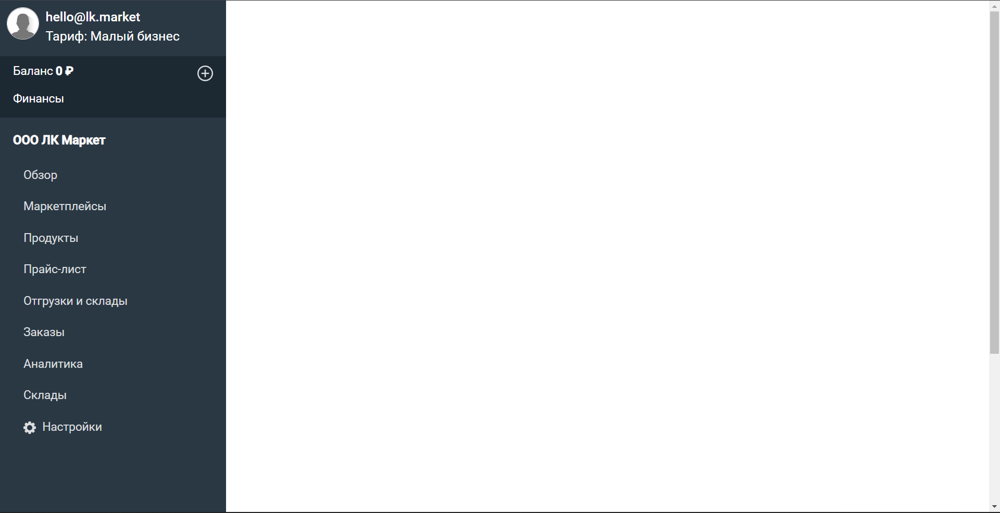
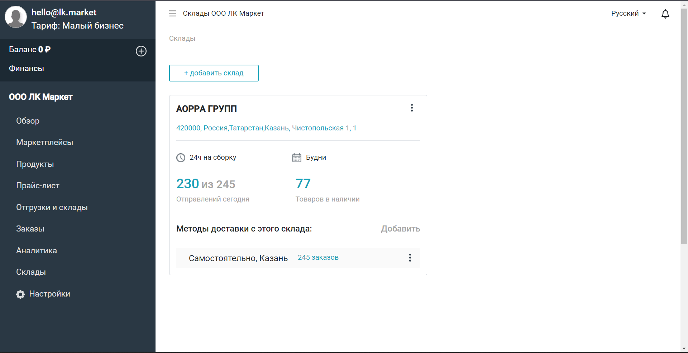
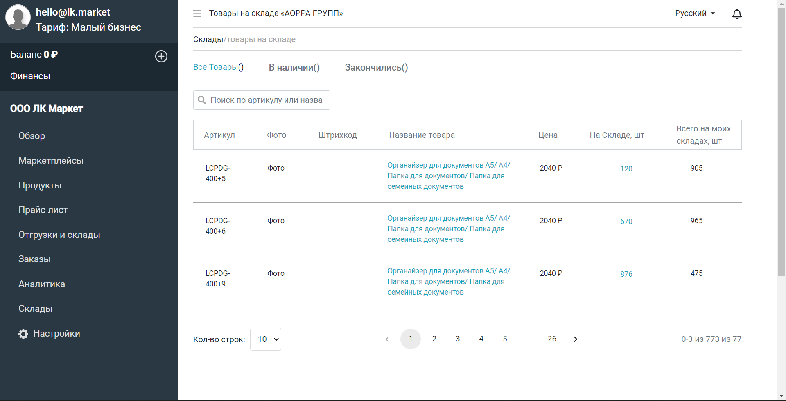
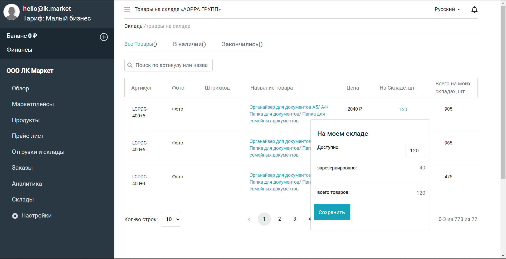
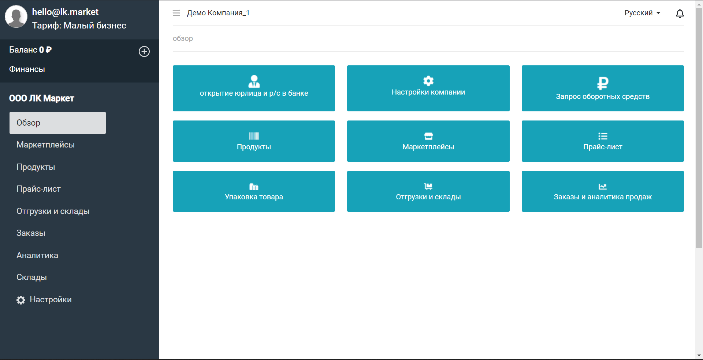
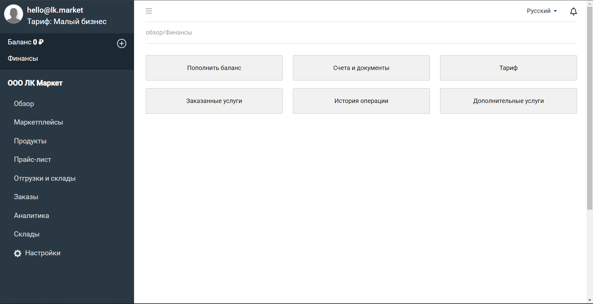
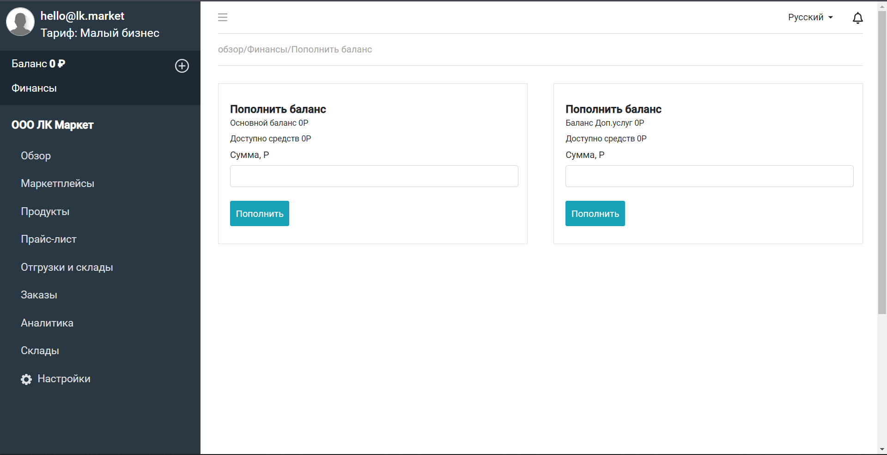
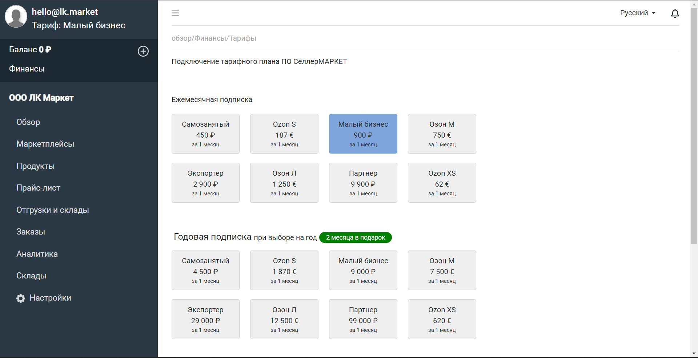

# **Warehouses-business**

Один из командных проектов, который дал мне большой толчок к развитию моих навыков как программиста.
Это был довольно сложный проект и интересный проект, было много разных интересных задач над которыми
я и мой коллега думали, решали, реализовывали.

- При запуске проекта нас встречает вот такой минималистический вид приложения

- После начала использования приложения, Вы можете попасть на несколько уже реализованных вкладок.
  Вот например открытая вкладка "Склады".

## **Функционал, Возможности и будущие возможности приложения.**

- Доступ к разным складам нашей страны  
- Просмотр продукции на тех или иных складах. 
- Сопоставление одного продукта с продуктом лежащим на другом складе.  
- Поиск по Артикулам продукта внутри складов.   
- Изменение остатков на складе. 
- Контроль над своими заказами. 
- Просмотр аналитики. 
- Просмотр и изменение Маркетплейса. 
- Просмотр продукции. 
- Просмотр отгрузок и складов. 
- пагинация. 
- Возможность выбора количества отображения товара на складах.  
и многие другие возможности.
-----------------------------------------------------------------------------------------------------------------

- На данном фото наглядно видно в каком стиле отображаются продукты находящиеся на одном из складов

- Затем на этом фото вы видите то каким образом можно изменять остаток товара на складе

- Далее мы можем перейти на вкладку "Обзор", и мы можем увидеть небольшое меню с разными вкладками.

- Так же мы можем перейти на вкладку "Финансы", и нам откроется небольшое меню, которое позволяет нам совершать 
  некоторые финансовые операции или же посмотреть историю операции

- Далее в этой вкладке мы можем перейти в "Пополнить баланс". Здесь мы можем увидеть что нас встречает 2 карточки
пополнения баланса, каждый из которых отвечает за ту или иную операцию. Так например первая карточка может пополнить
ваш основной баланс, а вторая же может пополнить баланс ваших доп.услуг.

-Так же из вкладки "Финансы", мы можем перейти на, под вкладку "Тарифы". Здесь мы можем выбрать тот или иной тариф
из тех что вы видите перед собой, естественно после выбора тарифа, немного ниже вы можете выбрать на какой срок вы
берете данный тариф и от какого лица оплачиваете. Есть 3 вида: Физ.лицо, счет баланса, банковская карта.
И программа вам выдаст сумму которую нужно будет внести для активации данного тарифа.

